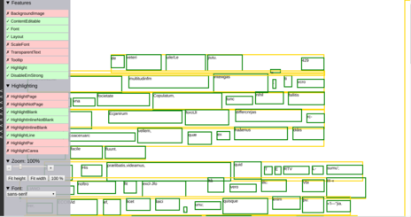
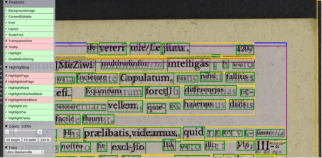
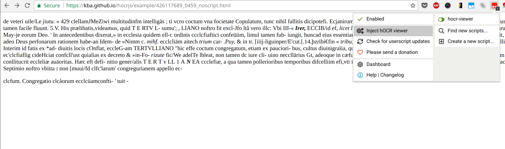

# hocrjs

> Working with [hOCR](https://kba.github.io/hocr-spec/1.2/) in Javascript

<!-- BEGIN-MARKDOWN-TOC -->
* [Screenshot](#screenshot)
* [Demo](#demo)
* [Simple Usage](#simple-usage)
* [User script](#user-script)
* [Command line interface](#command-line-interface)

<!-- END-MARKDOWN-TOC -->

## Screenshot




## Demo

See this demo document: [Demo](https://kba.github.io/hocrjs/example/426117689_0459.html)

## Simple Usage

To add the interface to a plain hOCR file, add this line just before the closing `</body>` tag:

```html
<script src="https://unpkg.com/hocrjs"/>
```

## User script

Also bundled is a browser extension that lets you add the hocrjs interface to
any hOCR document you browse on the web.

- It is a [user script](https://github.com/OpenUserJs/OpenUserJS.org/wiki/Userscript-beginners-HOWTO),
so you need to have a user script runner like
[Greasemonkey](https://addons.mozilla.org/en-US/firefox/addon/greasemonkey/) or
[Tampermonkey](tampermonkey.net) installed.
- Browse to [unpkg.com/hocrjs/dist/hocr.user.js](https://unpkg.com/hocrjs/dist/hocr.user.js)
- Install the user script when asked
- Browse to a plain hOCR document, e.g. [this one](https://kba.github.io/hocrjs/example/426117689_0459_noscript.html)
- Choose `Inject hOCR viewer` from the menu of the user script manager, e.g.



## Command line interface

hocrjs comes with a command line tool `hocrjs-inject` that inserts the
necessary `<script>` tag to a local hOCR document. To use it, first install
`hocrjs` system-wide:

```sh
npm install -g hocrjs
```

Then run `hocrjs-inject /path/to/ocr-doc.hocr`. The resulting file will be
`/path/to/ocr-doc.hocrjs.html` which you can open in a browser.
