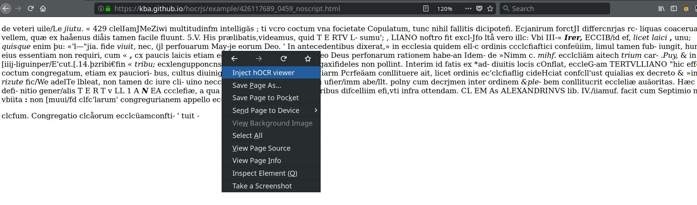

# hocrjs

> Working with [hOCR](https://kba.github.io/hocr-spec/1.2/) in Javascript

<!-- BEGIN-MARKDOWN-TOC -->
* [Showcase](#showcase)
	* [Demo](#demo)
	* [Video](#video)
	* [Screenshots](#screenshots)
* [Usage](#usage)
	* [Simple Usage](#simple-usage)
	* [User script](#user-script)
	* [Command line interface](#command-line-interface)
* [Development](#development)
	* [Layout](#layout)
	* [Features and SASS](#features-and-sass)
	* [Adding a feature](#adding-a-feature)

<!-- END-MARKDOWN-TOC -->

## Showcase

### Demo

See this demo document: [Demo](https://kba.github.io/hocrjs/example/426117689_0459.html)

### Video

[](https://youtu.be/II1lkjFc6zU)

### Screenshots


## Usage

### Simple Usage

To add the interface to a plain hOCR file, add this line just before the closing `</body>` tag:

```html
<script src="https://unpkg.com/hocrjs"/>
```

### User script

Also bundled is a browser extension that lets you add the hocrjs interface to
any hOCR document you browse on the web.

- It is a [user script](https://github.com/OpenUserJs/OpenUserJS.org/wiki/Userscript-beginners-HOWTO),
so you need to have a user script runner like
[Greasemonkey](https://addons.mozilla.org/en-US/firefox/addon/greasemonkey/) or
[Tampermonkey](tampermonkey.net) installed.
- Browse to [unpkg.com/hocrjs/dist/hocr.user.js](https://unpkg.com/hocrjs/dist/hocr.user.js)
- Install the user script when asked
- Browse to a plain hOCR document, e.g. [this one](https://kba.github.io/hocrjs/example/426117689_0459_noscript.html)
- Choose `Inject hOCR viewer` from the menu of the user script manager

Tampermonkey:


Greasemonkey:



### Command line interface

hocrjs comes with a command line tool `hocrjs-inject` that inserts the
necessary `<script>` tag to a local hOCR document. To use it, first install
`hocrjs` system-wide:

```sh
npm install -g hocrjs
```

Then run `hocrjs-inject /path/to/ocr-doc.hocr`. The resulting file will be
`/path/to/ocr-doc.hocrjs.html` which you can open in a browser.
## Development

To build hocrjs from source, you need Node.js and make.

Clone the repository and run `make` for a list of targets:

<!-- BEGIN-EVAL make help -->

  Targets

    dist   webpack
    clean  Remove built targets
    test   Run unit tests
    serve  Run a development server
    watch  Continuously rebuild dist

  Variables

    VERSION        Version of the latest git tag ('0.4.0')
    ASSET_SERVER   URL of the asset server, serving the built files and userscript ('https://unpkg.com/hocrjs@0.4.0/dist')
    UPDATE_SERVER  URL of the userscript update server ('https://unpkg.com/hocrjs', will automatically redirect to latest version)
    STATIC_SERVER  Command to run a static server ('@python2 -m SimpleHTTPServer 8888')
    PORT           Server port. ('8888')

<!-- END-EVAL -->

### Layout

The hOCR elements are positioned with `display: fixed`. The trick is that they are
within a container element that has `transformation`. This makes the fixed
positions relative to the container element instead of the viewport.

### Features and SASS

A feature is behavior that can be enabled or disabled and possibly configured,
such as displaying the background image (`BackgroundImage`) or whether to
disable `<strong>`/`<em>` display of text (`DisableEmStrong`).

If a feature is enabled, a class `hocr-viewer-feature-<NAME-OF-FEATURE>` will
be added to the root container.

These classes are used in the [SCSS
stylesheet](./src/components/hocr-viewer/index.js) to implement the desired
behavior using CSS, if possible.

### Adding a feature

Add `enableMyFeature` property to the [HocrViewer component](./src/components/hocr-viewer/hocr-viewer.js).

In [hocr-viewer.scss](`./src/components/hocr-viewer/hocr-viewer.scss) add rules
for `.hocr-viewer-feature-myFeature` as necessary.

If the behavior requires modifying the hOCR (e.g. `ScaleFont`), create a class
[`./src/components/hocr-viewer/feature/MyFeature.js`](./src/components/hocr-viewer/feature/)
that gets passed the component to the constructor and implements an
`apply(dom)` method to modify the HTML. Use the methods provided by
[hocr-dom](https://github.com/kba/hocr-dom) to access hOCR specific features
like properties.
